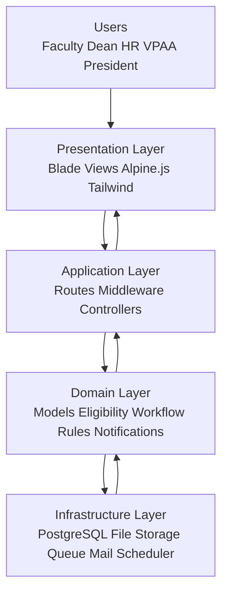

# Simple Layered Architecture

## Overview

The Faculty Reclassification System follows a layered monolith design inside one Laravel application.

## Layer Responsibilities

- Presentation Layer: renders UI, collects user inputs, shows workflow and dashboards.
- Application Layer: handles HTTP requests, authorization, validation, and use-case orchestration.
- Domain Layer: contains core business entities and rules for reclassification lifecycle and scoring.
- Infrastructure Layer: persists data, stores evidence files, sends notifications, and runs async jobs/scheduled tasks.

## Request Flow (Simple)

1. User interacts with Blade UI.
2. Request enters route + middleware.
3. Controller executes workflow logic with domain models/services.
4. Data is read/written in PostgreSQL and files/notifications are handled by infrastructure components.
5. Controller returns a rendered view or redirect response.
