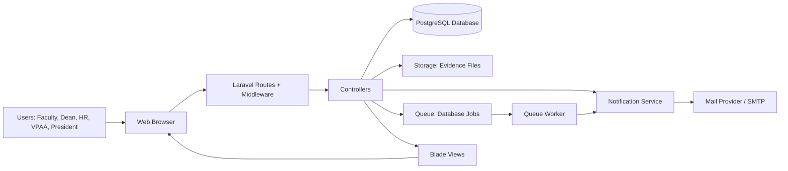
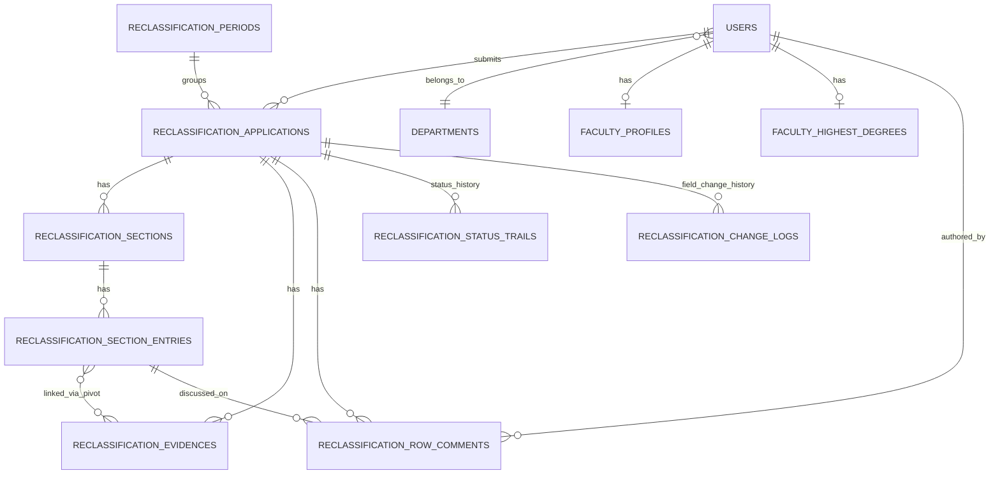
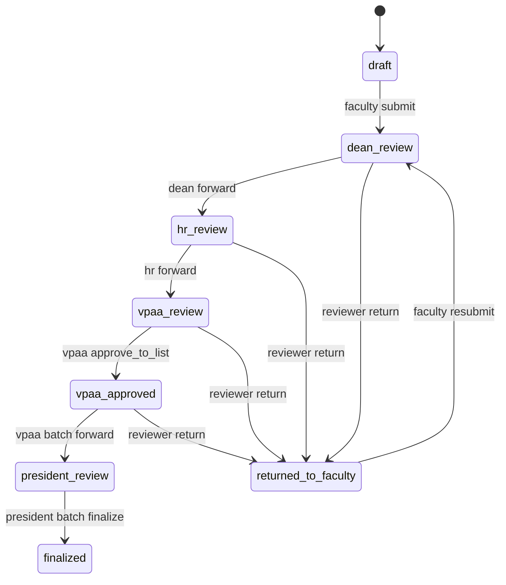
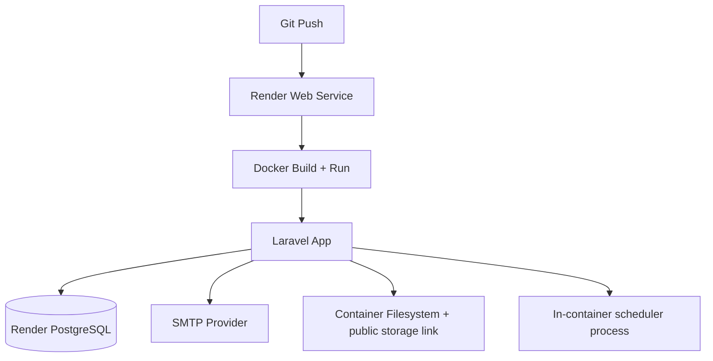

# Faculty Reclassification System Architecture

## 1. Purpose and Scope

This document describes the architecture of the Faculty Reclassification System implemented in this repository.
It covers:

- Runtime components and boundaries
- Core domain model
- Workflow and role-based control flow
- Data flow across modules
- Deployment topology

---

## 2. Technology Stack

- Backend framework: Laravel 12 (PHP 8.2)
- Authentication/UI baseline: Laravel Breeze (Blade)
- Frontend tooling: Vite, Tailwind CSS, Alpine.js
- Database: PostgreSQL (production), Laravel-supported relational DBs in development
- Queue, cache, sessions (current production blueprint): Database-backed
- Deployment: Docker container on Render

---

## 3. High-Level Architecture

### Architectural style

- Modular monolith (single Laravel application)
- MVC with domain-heavy controllers
- Route-level authorization plus role middleware
- Eloquent ORM for persistence and relationship mapping

---

## 4. Main Application Layers

## 4.1 Presentation Layer

- Blade templates in `resources/views`
- Role-specific dashboards:
  - Faculty
  - Dean
  - HR
  - VPAA
  - President
- Reclassification UI broken into sections and reviewer screens

## 4.2 HTTP/API Layer

- Main routing in `routes/web.php`
- Auth API endpoints for evidence review in `routes/api.php` (Sanctum middleware)
- Core route guardrails:
  - `auth`
  - `verified`
  - `role:<roles>`

## 4.3 Application Layer (Controllers)

- `ReclassificationFormController`: faculty draft/edit/section persistence/evidence handling
- `ReclassificationWorkflowController`: submit/return/forward/finalize status transitions
- `ReclassificationReviewController`: reviewer queue, review page, Section II scoring logic
- `ReclassificationAdminController`: submissions management, approved list, history, export
- `ReclassificationPeriodController`: cycle lifecycle and submission-window controls
- `ReclassificationRowCommentController`: reviewer-faculty threaded action comments
- `UserController`, `FacultyProfileController`: user and faculty record management

## 4.4 Domain/Support Layer

- `ReclassificationEligibility`: submission eligibility checks
- `ReclassificationNotificationService`: workflow and period notifications
- Policies for evidence review authorization

## 4.5 Persistence Layer

- Eloquent models for users, departments, faculty profiles, applications, sections, entries, evidence, comments, status trails, and change logs
- Migration-based schema evolution
- Extensive compatibility checks using `Schema::hasColumn` and `Schema::hasTable` to support progressive deployments

---

## 5. Core Domain Model

### Important entities

- `users`: role-bearing principals (`faculty`, `dean`, `hr`, `vpaa`, `president`)
- `reclassification_periods`: cycle and submission-window controls
- `reclassification_applications`: main process aggregate with workflow status
- `reclassification_sections` + `reclassification_section_entries`: structured form content and scoring inputs
- `reclassification_evidences` + pivot links: file-backed evidence artifacts
- `reclassification_row_comments`: reviewer-to-faculty action/feedback threads
- `reclassification_status_trails`: immutable status transition history
- `reclassification_change_logs`: field-level audit history for returned revisions

---

## 6. Workflow Architecture

## 6.1 Primary status flow

## 6.2 Terminal and administrative status paths

- `rejected_final` is used for final rejection cases (e.g., admin toggles)
- Once `finalized`, the approved rank snapshot is treated as authoritative

## 6.3 Workflow enforcement

- Route-level role guard plus stage ownership checks
- Department scoping for dean actions
- Active-period scoping for queue and actions
- Required action-comments must be resolved before forwarding
- Section II completion is required before Dean forwards to HR

---

## 7. Role-Based Access Topology

| Role | Core responsibilities |
|---|---|
| Faculty | Build draft, upload evidence, submit/resubmit, address reviewer comments |
| Dean | Department-scoped review, Section II scoring, return/forward decisions |
| HR | Institution-level review, period management, submission administration |
| VPAA | Senior review, approve to VPAA list, batch forward to President |
| President | Final batch approval and rank finalization |

Authorization controls combine:

- `role` middleware
- Controller-level ownership and status guards
- Policy checks for specific resources (e.g., evidence review)

---

## 8. Data Flow (Request to Persistence)

## 8.1 Faculty edit flow

1. Faculty opens form route.
2. Controller resolves or creates draft for active cycle context.
3. Section payload is validated and normalized.
4. Entries/evidence links are created, updated, or soft-removed.
5. Section totals and completion flags are recomputed.
6. Change logs are captured for returned submissions.

## 8.2 Reviewer flow

1. Reviewer opens queue filtered by role status and active period.
2. Reviewer opens submission with sections, evidence, comments, and audit trails.
3. Reviewer updates ratings/comments/evidence decisions.
4. Reviewer returns to faculty or forwards to next stage.
5. Status trail and notifications are recorded/sent.

## 8.3 Finalization flow

1. VPAA forwards approved list to President (`president_review` batch).
2. President finalizes batch.
3. Approval result snapshot is stored (`current_rank_label_at_approval`, `approved_rank_label`).
4. Faculty profile rank is updated if approved rank is higher.
5. Promotion and closure notifications are emitted.

---

## 9. Notification and Async Architecture

- Domain notifications are centralized in `ReclassificationNotificationService`.
- Supported events include:
  - Submission window opened/closed
  - Deadline reminders
  - Stage forwards/returns
  - VPAA approved-list events
  - President-finalized promotion notifications
- Queueable job:
  - `SendApprovedListForwardedToPresidentNotifications`
- Scheduler:
  - `reclassification:notify-deadlines` runs hourly

---

## 10. Deployment Architecture (Current)

### Container startup behavior

- Clears optimized caches
- Runs migrations
- Seeds production bootstrap data (departments/rank levels and optional admin)
- Creates storage symlink
- Starts scheduler worker and HTTP server

---

## 11. Key Design Decisions

- Single active period model with independent submission open/close flag
- Period-aware plus legacy-compatible application scoping
- Status-trail and change-log auditability baked into transitions
- Batch approval at VPAA -> President stages
- Rank finalization logic snapshot to preserve approval-time decisions

---

## 12. Known Architectural Constraints

- Large controllers carry both orchestration and business rules
- Limited automated tests for reclassification domain workflows
- Backward-compatibility checks add branching complexity in controllers
- README and architectural docs are not yet integrated into a full docs index

---

## 13. Recommended Next Documentation Artifacts

- Context + container + deployment diagrams (C4-style set)
- Role-permission matrix by route group
- Canonical status transition table with allowed actors/actions
- Data dictionary for major tables and status enums
- Sequence diagrams for submit, return, forward, finalize
